class: top, left

```{r xaringan-logo, echo=FALSE, include=TRUE}
xaringanExtra::use_logo(image_url = "https://ipes.ufsc.br/wp-content/themes/ipes-v1/images/logotipo.png")
```

```{r setup, include=FALSE}
options(htmltools.dir.version = FALSE)
```

```{r webcam, echo=FALSE, include= TRUE}
xaringanExtra::use_webcam()
```

```{r xaringan_themes, echo = FALSE, include=FALSE}
	names(xaringan:::list_css())
```

```{r broadcast, echo=FALSE}
xaringanExtra::use_broadcast()
```

# Sumário

</br>
### 1. INTRODUÇÃO
- Contextualização

</br>
--

### 2. CAPÍTULO I:  Vegetation-rainfall coupling as an indicator of ecosystem state in a heterogeneous landscape [(Cure et al. ,2023)](https://doi.org/10.1016/j.ecolind.2023.111268).


</br>
--

### 3. CAPÍTULO II: Unravelling distinct leaf phenologies in tropical vegetation types

</br>
--

###4. CONSIDERAÇÕES FINAIS

.center[
]

---
# Introdução 
## Ecossistemas são sistemas complexos

- Elementos bióticos e abióticos interagindo;
- Propriedades emergentes;


.center[
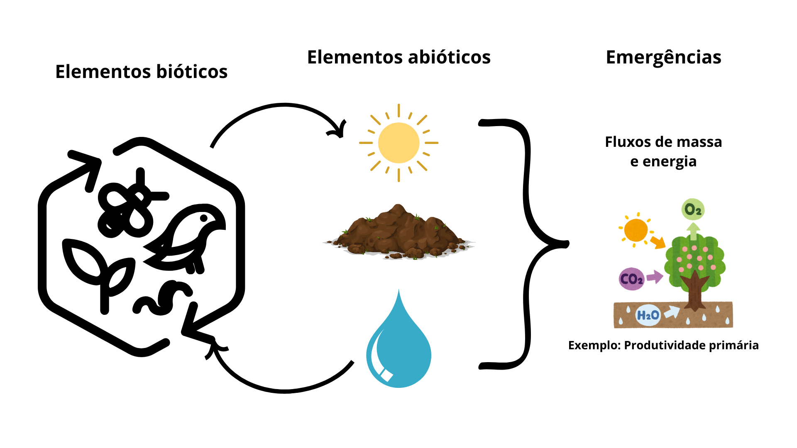
*Exemplos de ecossistemas*
  ]
---
# Introdução
##Variável de estado
</br>
### Por exemplo: Cobertura do dossel como uma variável que dá identidade ao sistema.

.center[


Exemplo: Savanas e florestas.]

---
# Intrudução
##Sistemas são dinâmicos 

- Mudanças graduais;
- Mudanças não-lineares;
- Mudanças abruptas com histerese: apresenta estados alternativos 
</br>

.center[
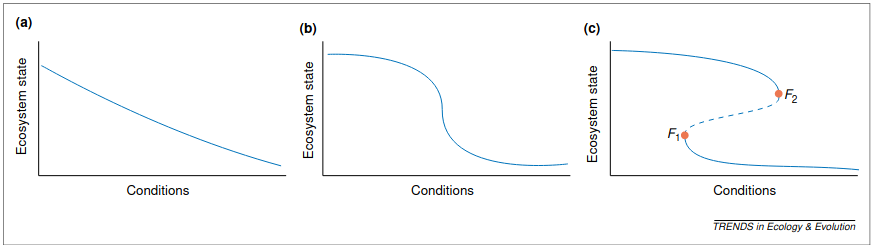
]
<br>
<br>
[Scheffer e Carpenter, 2003](https://doi.org/10.1016/j.tree.2003.09.002)
---
# Introdução
##Mecanismos de auto-organização

- Balanço entre os __feedbacks__ <font color = "blue">positivos</font> e <font color = "red">negativos</font>;
- Mantém/alteram identidade e propriedades emergentes.

--

.center[
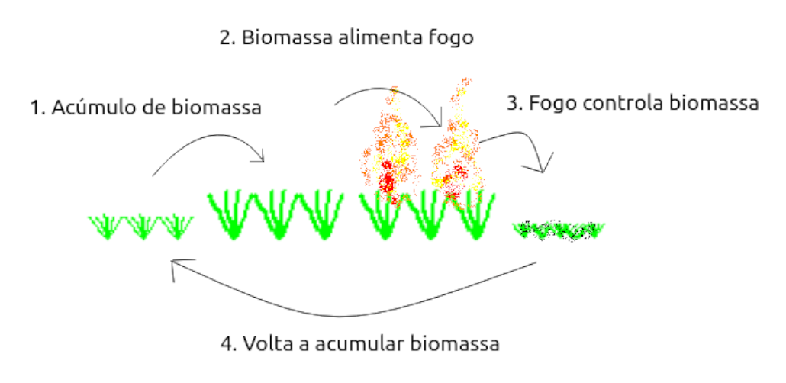
]
[Flores & Staal (2022)](); [Hoffmann & Jackson (2000)](); [Pausas & bond (2021)]()

---
# Resiliência

- Maneira de olhar para a dinâmica dos sistemas;
- Parte do pressuposto da existência de estados alternativos de funcionamento;

- **Definição:** Capacidade dos sistemas de absorver impactos antes de mudar para um estado alternativo ([Holling, 1973]());


.center[
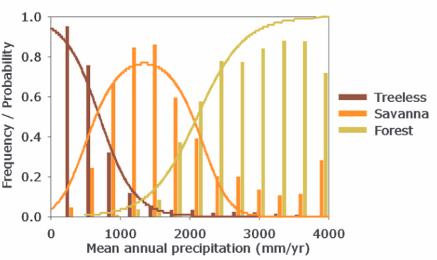
]

Ex.: Florestas e savannas são estados alternativos definidos parcialmente pelo regime de chuvas [Hirota et al., 2011]().

---
# Mecanismos de regulação hídrica
</br>
### - Evitar falha hidráulica;
### - Diferentes estratégias
### - Determinado pela disponibilidade de recursos.

.center[

  ]

[Oliveira et al., 2021](https://nph.onlinelibrary.wiley.com/doi/full/10.1111/nph.17266)
</br>[Brodribb & Holbrook (2003)](https://nph.onlinelibrary.wiley.com/doi/full/10.1046/j.1469-8137.2003.00736.x)</br>[Slelton et al., 2015]()
---
# Fenologia foliar
</br>
## Proxy para o funcionamento da vegetação
### - Ciclos biológicos impulsionados por variações sazonais no ambiente

### - Indicador da variação anual da produtividade primária

### - Decíduas e sempre verdes

.center[

]
---
# Lacuna do conhecimento
***
</br>
### Nenhum estudo até o momento caracterizou de forma abrangente os estados funcionais da vegetação em escala local e continental.

.center[]

---
# Objetivo geral
***
</br>
###Entender a resiliência da vegetação tropical brasileira em um contexto de mudanças, com base na caracterização dos estados funcionais da vegetação e sua resposta fenológica à variação sazonal da chuva, considerando fatores ambientais em escala local e continental.

.center[


Foto de Rafael Oliveira]

---

# Objetivos específicos
***
</br>
### **Capítulo I**: Diferenciar funcionalmente os tipos de vegetação coexistentes em uma mesma paisagem do Cerrado; e

</br>
--

### **Capítulo II**: Testar se na escala continental a resposta de florestas e savanas, entre tipos decíduos, sempre verdes e de semidecíduos em relação à variação sazonal da chuva são influenciados pelo regime climático de larga escala.
---

# Capítulo I: 
***
</br>
### **Capítulo I**: Trata dos estados funcionais da vegetação na escala de paisagem.


.center[
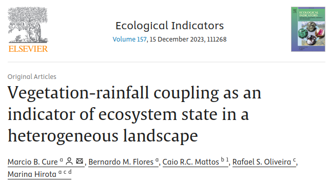
]

---
.center[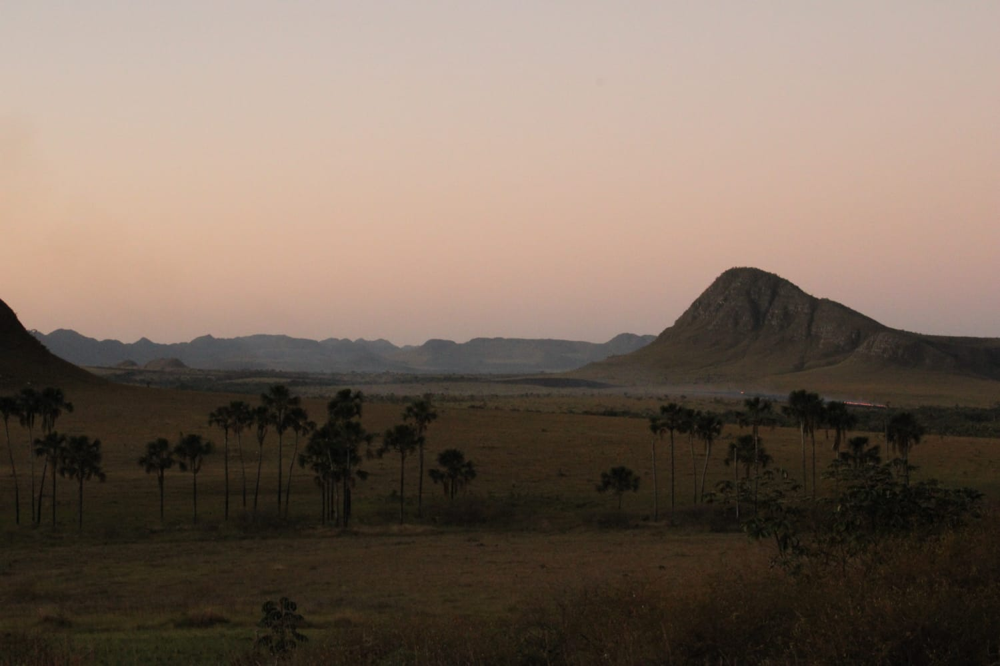

*Vereda no Jardim de Maythrea - PNCV*]


---
# Capítulo I - Introdução
## Savanas e Florestas na região tropical

- São estados alternativos em termos de estrutura da vegetação (cobertura do dossel) determinados parcialmente pela PMA. 

```{r figure1, include=TRUE, echo=FALSE, out.width="100%", fig.align='center', fig.pos='bottom', fig.cap="Hirota et al (2011) Science"}
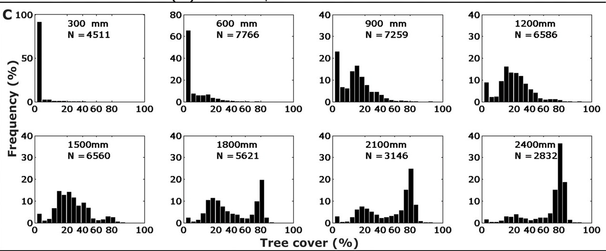
```
---
class: top, left
# Capítulo I - Introdução
## Sob o mesmo regime de precipitação...

- __Savannas__ e __florestas__ dividem a mesma paisagem e sua distribuição é determinada pelo regime de fogo, disponibilidade de água e características do solo.  


...que são determinados pelos Feedbacks entre a vegetação e o meio abiótico. (Frequentemente baseado na estrutura da vegetação)

.center[ 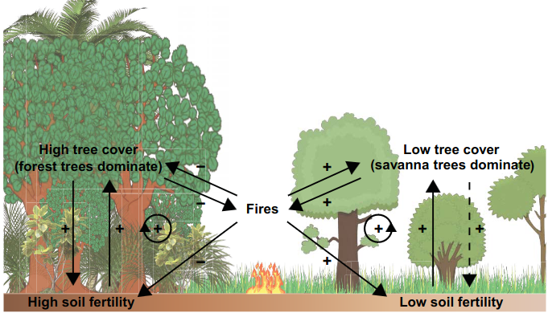

*Staal & Flores (2015)*]

*Ferreira et al (2007); Dantas et al (2016); Veenendaal et al (2018); Pausas et al (2020); Bernardino et al (2021)*

---
# Capítulo I - Introdução

## Há diferentes tipos funcionais de Florestas

- Por exemplo, **matas secas** e **matas de galeria**.

.center[


*Dexter et al., 2018*
  ]
  
---
# Capítulo I - Introdução
## Relação entre estrutura e funcionamento


<h4>
 Estudos sugerem que o funcionamento da vegetação seja correspondente à estrutura. (Dantas et al 2015; Xu et al 2016; Bernardino et al 2021)
</h4>

####  (Área basal, BT, Altura da árvores, como proxy da funcionalidade).


.center[
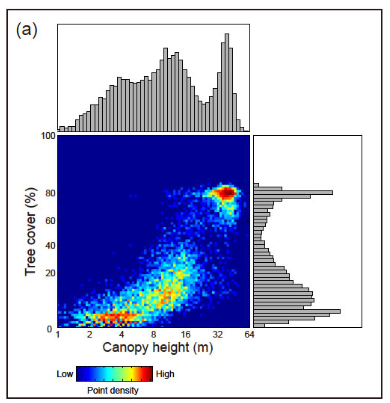
]

---
class: top, left
# Capítulo I - Introdução
## Produtividade primária como um proxy do funcionamento da vegetação


#### Produção primária bruta é uma função básica para os ecossistemas e pode ser inferida por índices derivados de imagens de satélite *Biudes et al (2021)*.

.center[

]

---
# Capítulo I
## Pergunta:

### Matas secas, matas de galeria e savanas podem ser diferenciados funcionalmente com base na resposta espectral da vegetação à variação sazonal na chuva?

## Hipótese:
### Esperamos que o acoplamento entre o verdor foliar e a chuva possa diferenciar os tipos de vegetação e reflete diferentes estratégias dependentes das condições ambientais locais.

---
# Capítulo I - Métodos
### Área de estudo
- Parque Nacional da Chapada dos Veadeiros
- 30 parcelas de 200m²
- <font color="purple">Mata seca</font>, <font color="blue">Mata de Galeria</font> e <font color="orange">Cerrado <i>stricto sensu</i></font>

.center[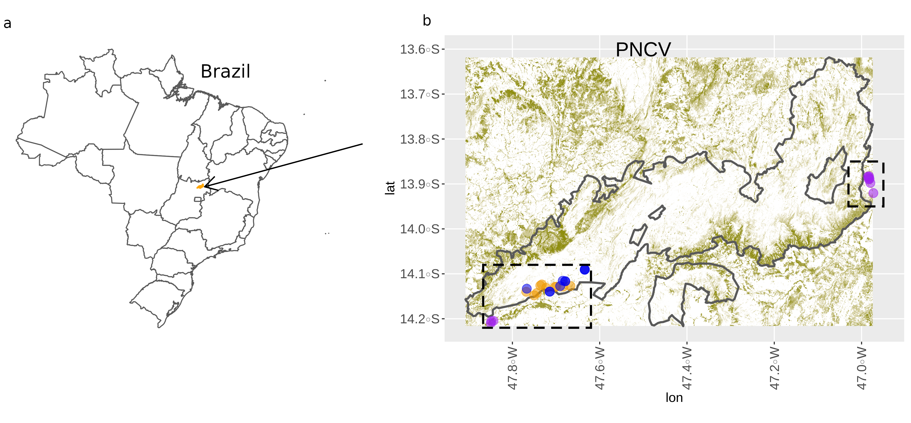]
---
# Capítulo I - Métodos
</br>
### Usamos dados de campo e de satélite para caracterizar as condições ambientais e os estados da vegetação.
</br>
.center[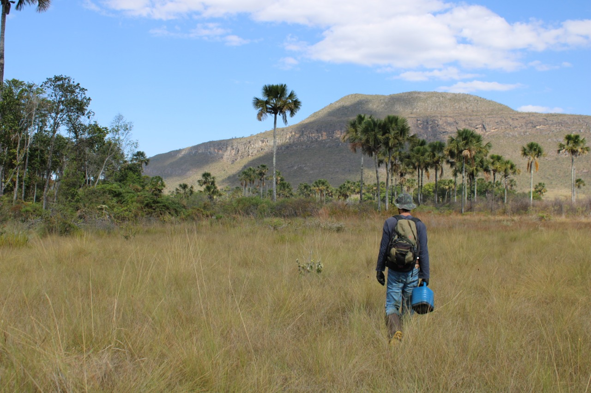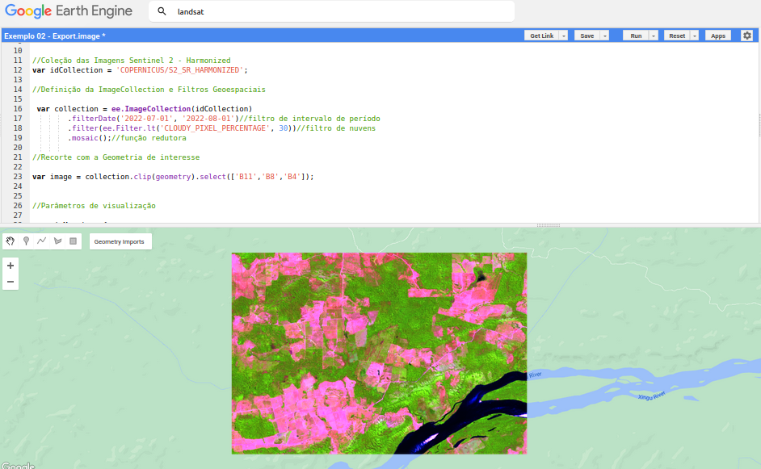]

---
# Capítulo I - Métodos
</br>
### Caracterização das condições ambientais: 

####- <font color="brown">fis/quim do solo</font>: PCA

####- <font color="blue">água no solo</font>: Topographic wetness index (TWI) [Beven & Kirkby (1979)](https://www.sciencedirect.com/science/article/pii/S1470160X23014103#b0055)

.center[$TWI=ln(A_s/tan\beta)$]

.center[]

---
# Capítulo I - Métodos
</br>
### Caracterização do regime de chuva: **Série temporal de precipitação**


#### Precipitação mensal do CHIRPS (resolução de ~ 5 Km)

- MAP e MSI ([Markham, 1970]())
</br>
.center[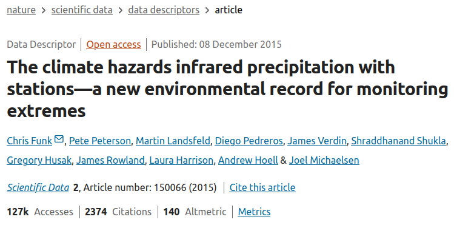] 
---
# Capítulo I - Métodos
</br>
### Variável de estado estrutural: **Cobertura do dossel**

- Cobertura do dossel usando o densiômetro florestal côncavo;
- Coleta nas estações seca e chuvosa;
- $Deciduidade = TreeCover_c - TreeCover_s$

.center[]
---
# Capítulo I - Métodos
</br>
### Variáveis de estado estruturais/funcionais: **Atributos da vegetação**
#### Obs.: Estas variáveis já foram usadas como proxy de funcionalidade
- Altura das árvores (Xu et al., 2016);
- Área basal (Dantas et al., 2015);
- Espessura de casca (Bernardono et al, 2021).


.center[ 


]
---
# Capítulo I - Métodos
</br>
### Variáveis de estado funcionais: **Dados de satélite**

- Landsat 8 (30m x 30m; a cada 16 dias; 2013-2018)
- $EVI2 = 2.5*(NIR-RED)/(NIR+(2.4*RED)+1)$
- Média, desvio padrão

.center[]
---
# Capítulo I - Métodos
</br>
### Variável de estado proposta neste trabalho: **Acoplamento**

#### - Correlação de Kendal entre séries de EVI2 e chuva;
#### - Acoplamento = Maior resposta considerando atrasos em meses (0 a 6);
#### - Lag: atraso para a maior resposta em meses.

```{r figure2, include=TRUE, echo=FALSE, out.width=800,out.height=295,fig.dim=40, fig.align='center', fig.cap="Exemplo acoplamento"}
library(tidyverse)

data <- read_rds("/home/mcure/Documents/IFFSC/dados_completos.rds")
teste <- data |>
  filter(coupling < 0) |> select(tabela) |>  pluck(1) |>
  pluck(1) |>
  select(time, rainfall, temperature, monthly_evi2)

library(plotly)

#plot_2 <-
plotly::plot_ly(teste) %>%
  plotly::add_lines(x=~time,y=~monthly_evi2,name = 'Mean monthly EVI2',connectgaps = F, color = I("green4")) %>%
  plotly::add_lines(x=~time,y=~rainfall,name = 'Mean monthly rainfall',type = 'scatter',mode = 'lines+markers',connectgaps = FALSE,yaxis = "y2", color = I("blue")) %>%
  plotly::layout(title = 'A',
         xaxis = list(title = "Month"),
         yaxis2 = list(side = 'right', overlaying = "y", title = 'Mean monthly precipitation (mm)', showgrid = FALSE, zeroline = FALSE))

```

---
# Capítulo I - Métodos
### Testamos as diferenças entre os tipos de vegetação - **Teste de Mann-Whitney**

#### - Variáveis de estado estruturais e funcionais;
#### - Condições ambientais.

.center[]
---
# Capítulo I - Resultados e Discussão

### Regime de chuva - Parcelas estão no mesmo regime de chuva.
.center[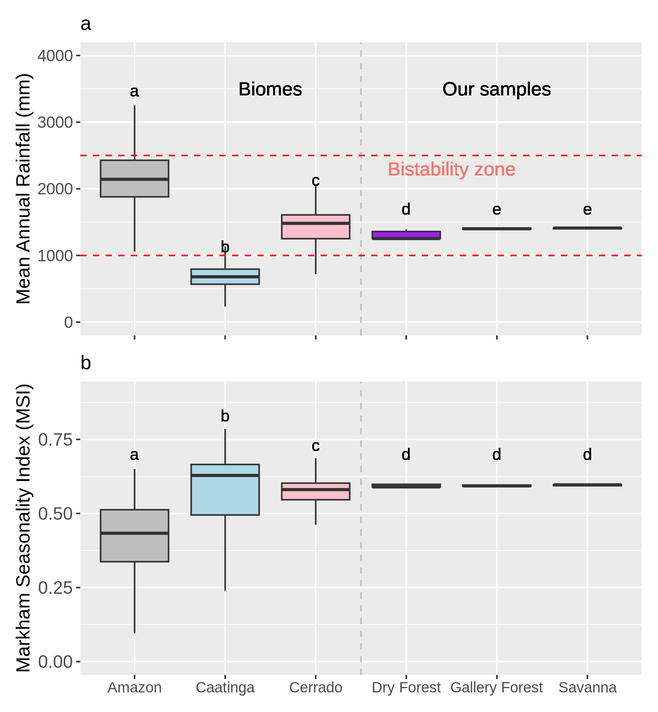
Staver et al. (2011)
]
---
# Capítulo I - Resultados e Discussão
### Condições ambientais locais - PCA das variáveis do solo.

.center[ 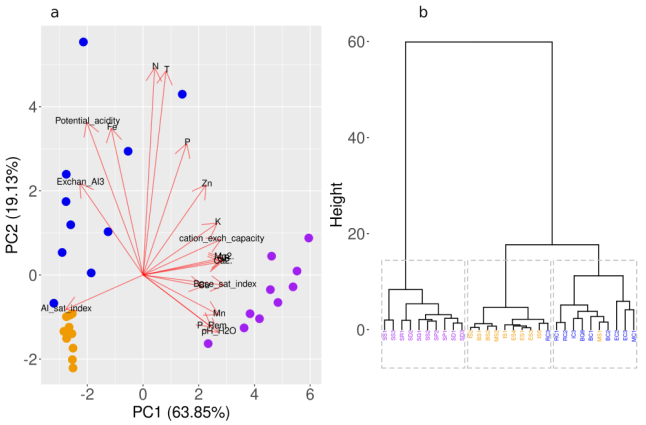
]

---
# Capítulo I - Resultados e Discussão
### Condições ambientais locais - Tipos de vegetação diferem.
.center[ 

Ratter & Dargie, 1992; Oliveira & Marquis, 2002; Ribeiro & Walter, 2008; Cowling & Potts, 2015; Lira-Martins et al., 2022]


---
# Capítulo I - Resultados e Discussão
</br>
### Variáveis de estado estruturais.

.center[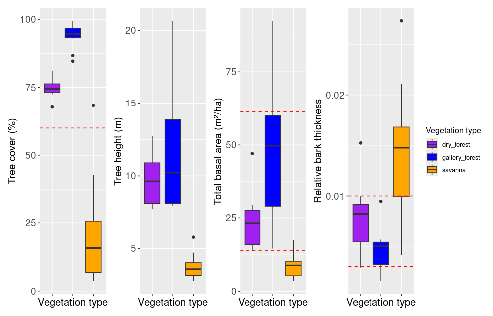]

Xu et al., (2015); Dantas et al., (2016); Bernardino et al., (2022)
---
# Capítulo I - Resultados e Discussão
### Variáveis de estado funcionais 
</br>
<b><font color="purple">Mata seca</font>;
<font color="blue">Mata de Galeria</font>;
<font color="orange">Savana</font></b>

</br>
.center[ 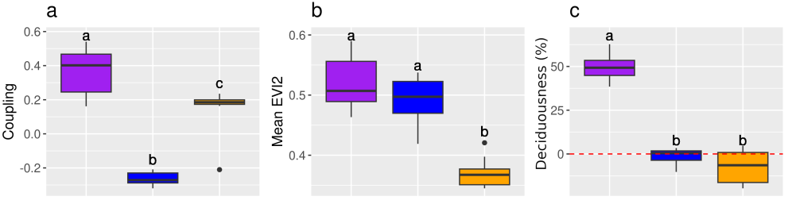
]

### Tipos de vegetação diferem funcionalmente.

---
# Capítulo I - Resultados e Discussão

### Mata de galeria aumenta o greenness na estação seca;
- Acesso perene à água (Veneklaas et al., 2005; Bueno et al., 2018);
- Não é limitada por água e sim por luz (Green et al., 2020, Smith et al., 2020)
.center[
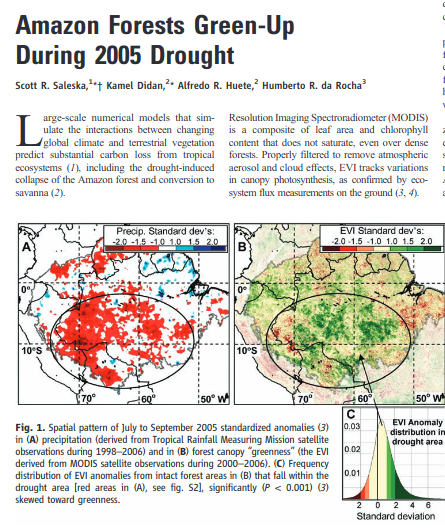    
]
---
# Capítulo I - Resultados e Discussão

### Matas secas perdem as folhas na estação seca
</br></br>
.center[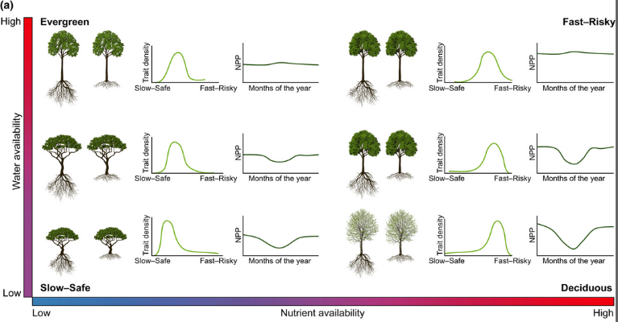]

Oliveira et al., (2021)
---
# Capítulo I - Resultados e Discussão
### Árvores de savana não são sensíveis à diminuição da precipitação durante a estação seca;

- Diversidade de estratégias de tolerância à seca;
- Acesso à água (raizes);
- Facilitação;
- Controle da perda d'água

.center[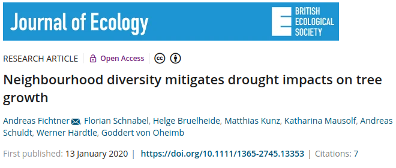
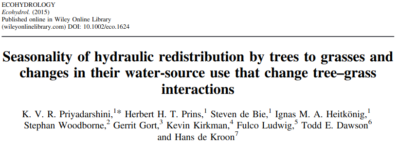
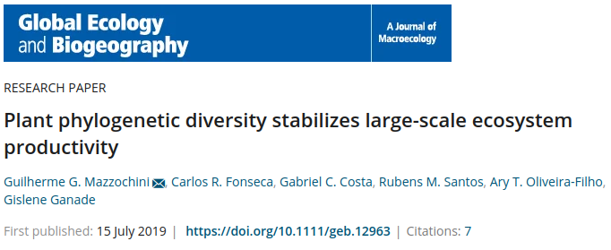
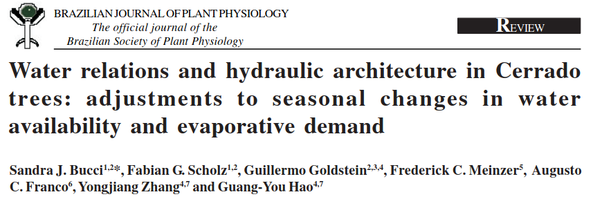
]
---
# Capítulo I - Resultados e Discussão
### Variáveis de estado - Relação com a cobertura do dossel.
.center[ 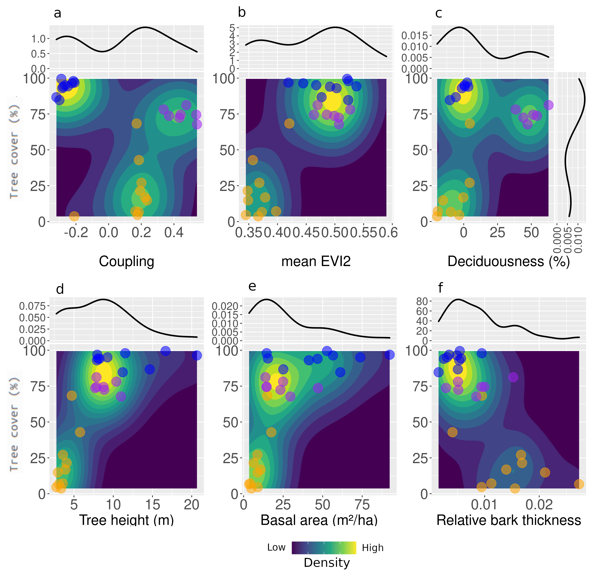
]

---
# Capítulo I - Conclusão
## Hipótese: Tipos de vegetação coexistentes podem ser diferenciados pela resposta do verdor foliar à variação sazonal na precipitação.

--

#### - Tipos de vegetação distintos coexistem em paisagens tropicais.

--

#### - Tipos de vegetação coexistentes respondem de maneira diferente à variação sazonal das chuvas.

--

#### - Ecossistemas estruturalmente similares (florestas secas e de galeria) são - funcionalmente distintos.

--

#### - As respostas são parcialmente determinadas pela disponibilidade de nutrientes e água no solo.

--

#### - A relação entre a precipitação e o verdor foliar é um bom indicador dos estados funcionais da vegetação.


---
# Capítulo II: 
***
</br>
### **Capítulo II**: Testa se a resposta da vegetação na escala continental é influenciada pelo regime climático.

## Unravelling distinct leaf phenologies in tropical vegetation types
#### Marcio Baldissera Cure; Bernardo Monteiro Flores; Marina Hirota


---
# Capítulo II - Introdução
</br>

### Partindo do <u>Capítulo I</u> (Escala de paisagem):
#### - Tipos de vegetação com funcionamento diferente coexistem;
#### - Diferentes respostas denotam estratégias diferente para lidar com períodos de seca;
#### - Acoplamento verdor foliar-chuva pode diferenciar os tipos de vegetação coexistentes, enquanto que as variáveis estruturais não conseguem.
---
# Capítulo II - Introdução
</br>
###  A heterogeneidade da vegetação desafia o entendimento das respostas dos ecossistemas às variações ambientais.

#### - Respostas são refletidas na fenologia foliar

#### - Incerteza nas respostas da vegetação
#### - Dificuldade de representar variação sazonal dos fluxos de água e carbono
.center[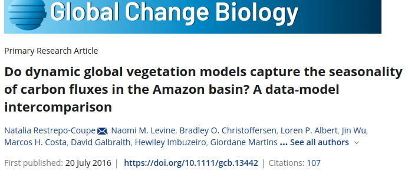]
---
# Capítulo II - Introdução
</br>

### Modelos se baseiam em características das plantas relativas à fenologia (e.g., PFTs);
#### - Não levam em conta variabilidade intraespecífica (Albert et al., 2012)
#### - Não levam em conta variabilidade ambiental

.center[]


---
# Capítulo II - Introdução
## Pergunta 1:

### A classificação da deciduidade da vegetação com base na florística  reflete a resposta espectral da vegetação às variações na chuva?

## Hipótese 1:

### Esperamos que exista uma heterogeneidade nas respostas devido à variabilidade intraespecífica e ambiental.

.center[<b><font color="green">Sempre verdes</font></b> - Acoplamento negativo

<font color="purple"><b>Decíduas</b></font> - Acoplamento positivo

<font color="orange"><b>Semidecíduas</b></font> - Respostas heterogêneas
]

---
# Capítulo II - Introdução
## Pergunta 2:
### Existe relação entre a resposta espectral da vegetação com o regime climático?

## Hipótese 2:
### Esperamos que o acoplamento entre o verdor foliar e a chuva seja dependente do regime climático.

<b><font = color="green">Acoplamento negativo</font></b>: Alta MAP; Baixa sazonalidade; Baixo VPD

<b><font color="purple">Acoplamento positivo</font></b>: Baixa MAP; Alta sazonalidade; Alto VPD

<b><font color="orange">Respostas heterogêneas</font></b>: MAP, sazonalidade e VPD <i>intermediários</i>

---
# Capítulo II - Métodos

## Pontos de amostragem
#### - Dados usados em [Dexter et al. (2018)](https://www.frontiersin.org/journals/ecology-and-evolution/articles/10.3389/fevo.2018.00104/full)
#### - 3990 pontos do [NeoTropTree database](http://www.neotroptree.info/)

.center[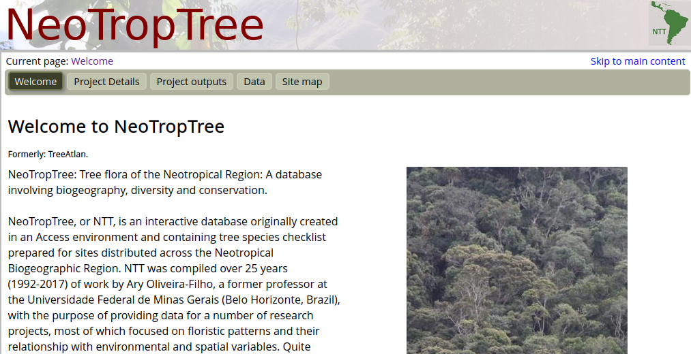]

---
# Capítulo II - Métodos
## Caracterização da vegetação: com base na composição de espécies

- <b><font size="5" color="brown">Decídua</font></b>
- <b><font size="5" color="orange">Semidecídua</font></b>
- <b><font size="5" color="green">Sempre verde</font></b>

.center[]
--
 <b>Testar se essa classificação fenológica reflete a resposta espectral da vegetação.</b>

---
# Capítulo II - Métodos

## Dados espectrais
#### - Sentinel 2 (10m x 10m; a cada 5 dias);
#### - Calculamos o EVI2:
$EVI_2 = 2.5*(NIR-RED)/(NIR+(2.4*RED)+1)$

.center[ 

[Sentinel-2](https://en.wikipedia.org/wiki/Sentinel-2)]

---
# Capítulo II - Métodos

## Seleção dos pontos de amostragem


#### - Pontos com menos de 35% de valores faltantes ([Feng et al., 2021]());
--

#### - Completamos as séries com NAs usando interpolação linear;
--


#### - Selecionamos <font color="green">Florestas</font> e <font color="orange">Savanas</font> usando o [MapBiomas](http://mapbiomas.org) (n = 1037) 

.center[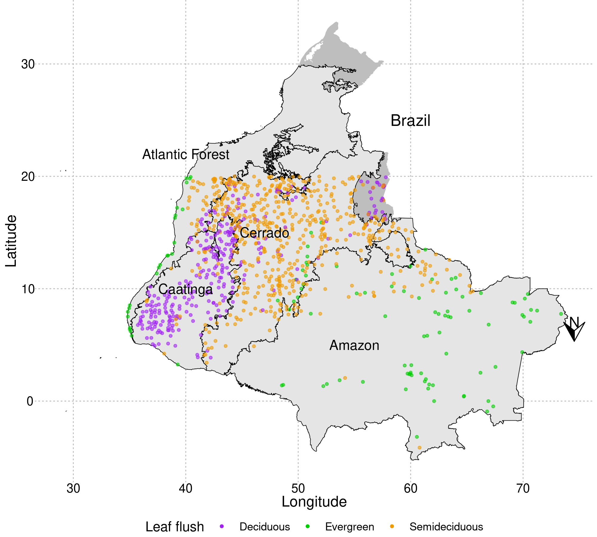]
---
# Capítulo II - Métodos
## Caracterização da vegetação: Dados espectrais

### - Calculamos o <u>EVI2 médio para cada mês</u> de 2019 até 2022; 

--

### ...e a partir daí, calculamos várias métricas:

.left-side[
<list>
1. Média;
2. Desvio padrão;
3. Amplitude;
4. Entropia;
5. Mínimos;
6. Máximos;
7. Anomalia; e
8. Ciclo anual (Média para cada mês).</list>
]
##### PCA com todas as métricas pra reduzir em dois eixos - Testamos diferenças entre tipos fenológicos e tipos de vegetação.
.center[]

---
# Capítulo II - Métodos
## Seleção das métricas que melhor separam os tipos fenológicos baseados na florística

### Modelo de classificação Random Forest
- Separamos em treino (70%) e teste (30%)

.center[ ]

### Importância de cada métrica usando o Índice de Gini
---
# Capítulo II - Métodos

## Usamos as melhores métricas para testar se elas separam o tipo fenológico baseado na florística.

### Agrupamento usando o algorítmo C-means (2 grupos)
- Pontos podem pertencer a mais de um cluster;
- É atribuido um valor de grau de pertencimento ao grupo: **Pertinência**
- Excluimos pontos com menos de 70% de pertinência: <b>sobraram 991 pontos</b>.

.center[]

---
# Capítulo II - Métodos
## Testar se clima influencia a resposta da vegetação à sazonalidade da chuva

### Caracterizar regime climático:
#### Calculamos MAP e MSI com base no CHIRPS 
#### Temperatura do ERA5-Land
#### VPD [(Grossiord et al., 2020)]()

.center[]

---
# Capítulo II - Métodos
## Resposta da vegetação à variação sazonal da chuva

### Calculamos o <u>acoplamento</u> [(Cure et al., 2023)](https://www.sciencedirect.com/science/article/pii/S1470160X23014103#s0075) para cada ponto.
 #### - Resposta da vegetação: Maior acoplamento (0 a 4 meses)
 #### - Testamos diferenças entre grupos, tipos de vegetação, tipos fenológicos e biomas
 
.center[ ]
---
# Capítulo II - Métodos
##  Estamos interessados em como diferentes variáveis ambientais em grande escala (MAP, MAT, MSI, VPD) afetam o acoplamento.
 
  ###  Ajustamos dois modelos lineares de mínimos quadrados para cada variável ambiental:
- Um modelo para pontos com acoplamento negativo (NEG).
- Outro modelo para pontos com acoplamento positivo (POS).

### Seleção dos modelos:
- Critério de Informação de Akaike (AIC)

---
# Capítulo II - Resultados
### Resumo das métricas do EVI2
.center[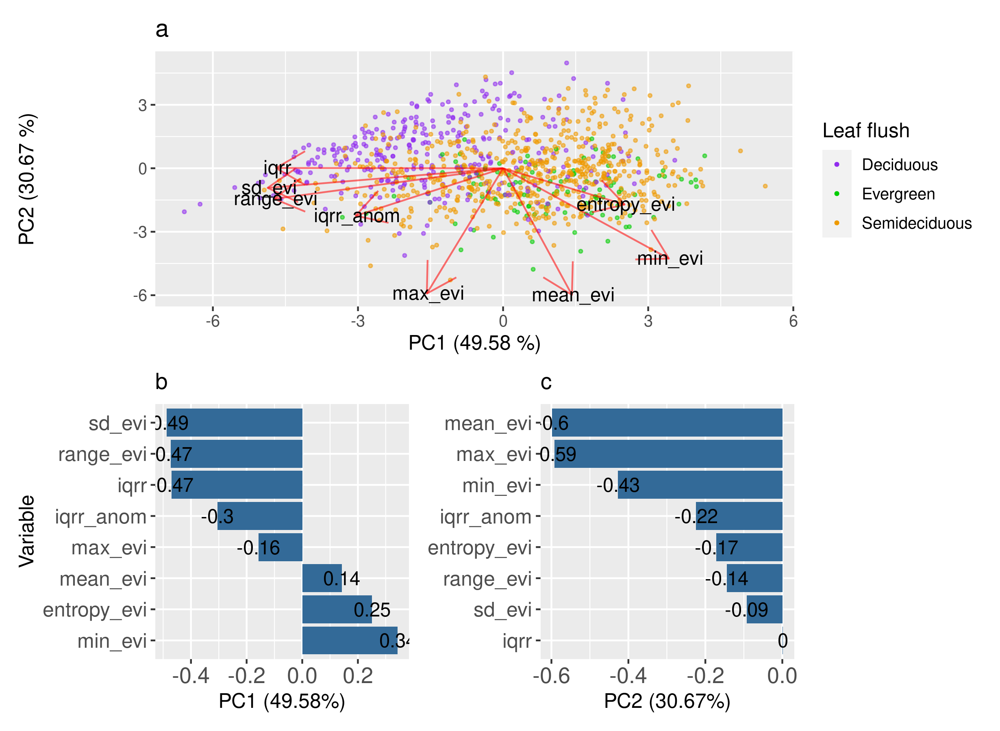]
 
---
# Capítulo II - Resultados
### Variáveis mais importantes para separar os tipos fenológicos baseados em florística
.center[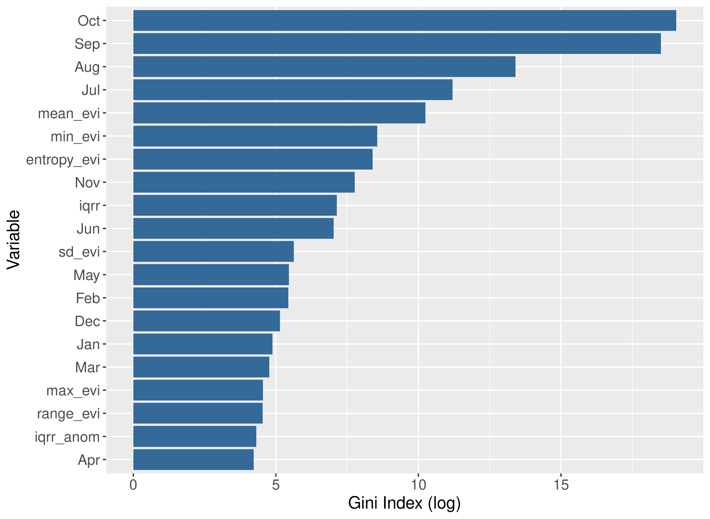]

---
# Capítulo II - Resultados
### Agrupamento pelo c-means
.center[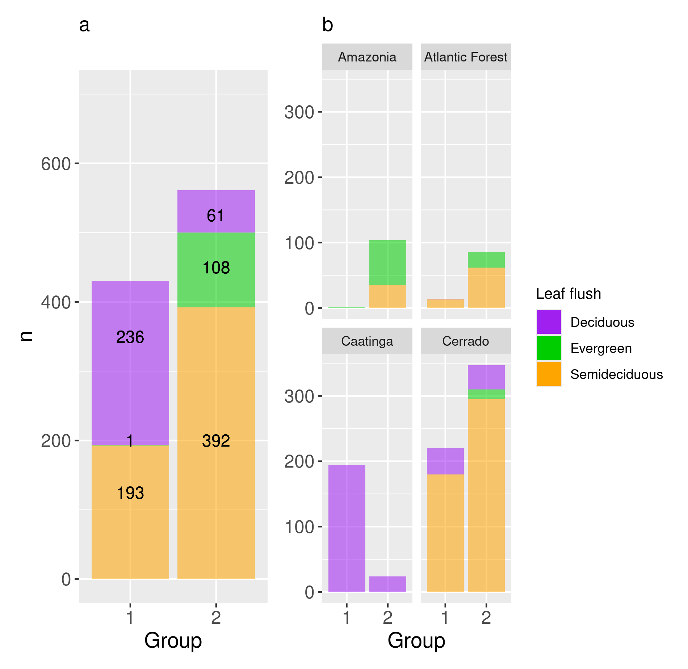]
 
---
# Capítulo II - Resultados
### Ciclo anual do EVI2 por grupo
.center[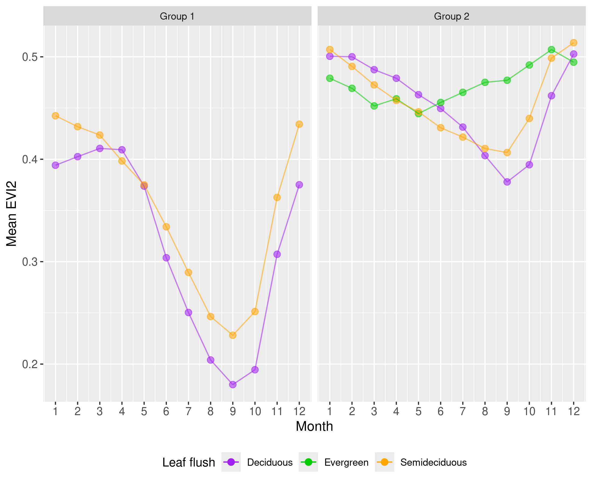]

---
# Capítulo II - Resultados
### Relação com o clima
.center[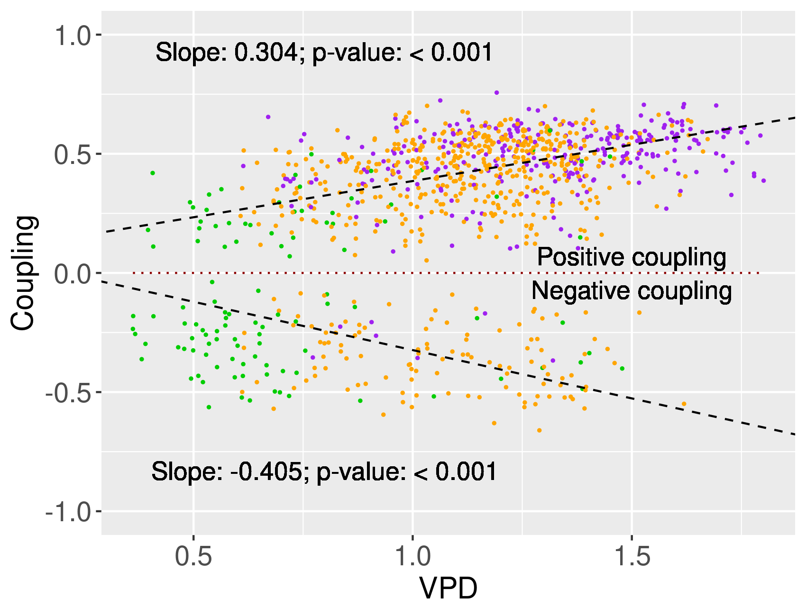]

---
# Capítulo II - Resultados
### Biomas apresentam condições ambientais particulares
.center[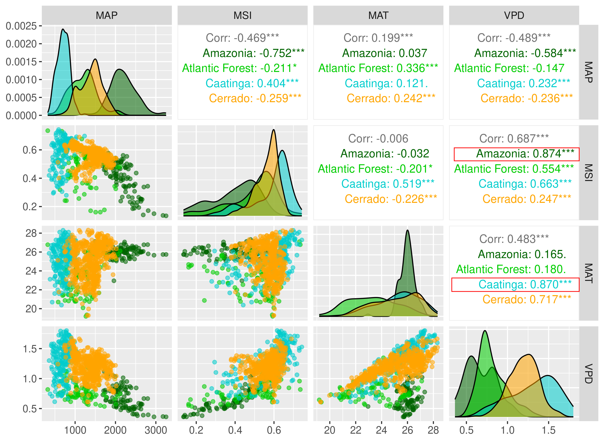]


---
# Capítulo II - Discussão

## Diversidade de respostas

### Variabilidade intraespecífica
.center[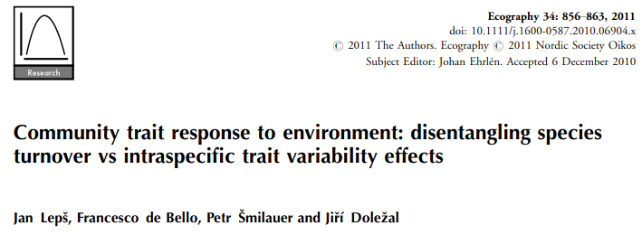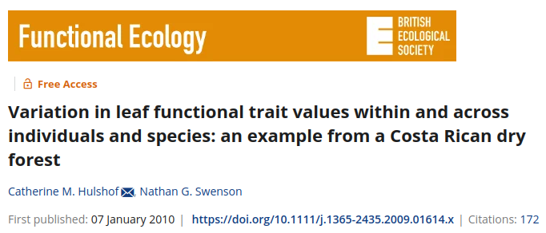]

--

### Disponibilidade de água e nutrientes no solo
.center[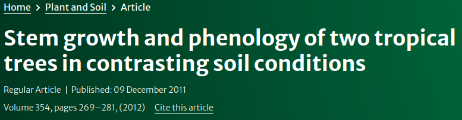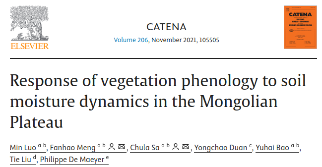]

---
# Capítulo II - Conclusão
## Hipótese 1: Tipos fenológicos refletem o sinal espectral da vegetação

--


#### - As classes de brotamento foliar baseadas na florística representam <u>mal</u> as dinâmicas de verdor detectadas por sensoriamento remoto;

--


#### - Comunidades decíduas e sempre-verdes diferem nas respostas, e semidecíduas mostram ambos os comportamentos;

.center[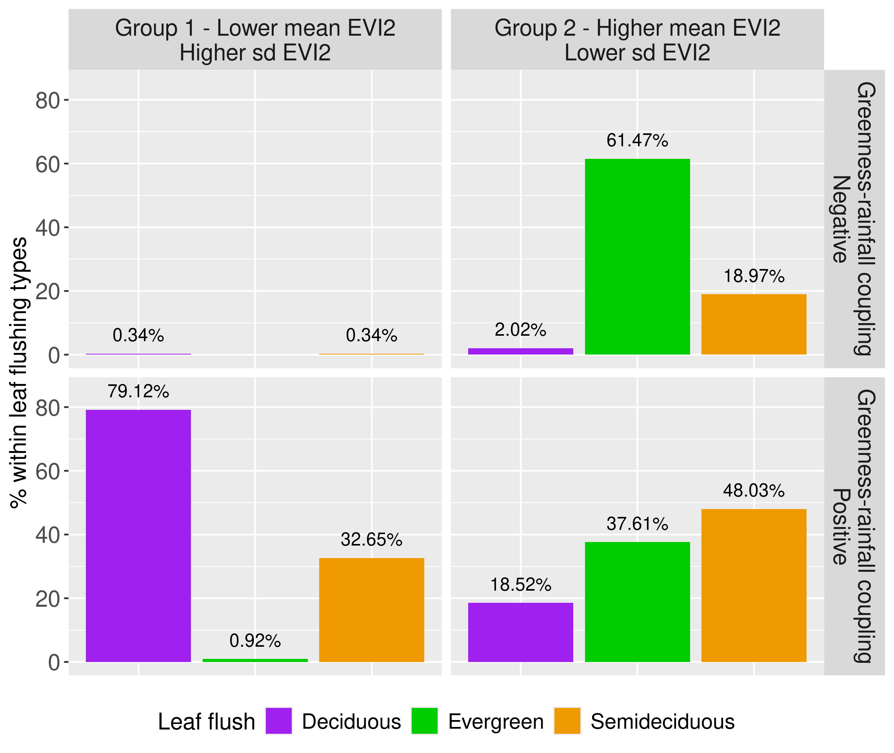]

---
# Capítulo II - Conclusão
## Hipótese 2: A resposta da vegetação depende do regime climático.


### - O acoplamento depende dos regime climático onde a comunidade está inserida.

---
# Considerações Finais
***
#### - Diferentes tipos de vegetação possuem respostas diferentes;

--

#### - Variáveis funcionais são mais efetivas do que variáveis estruturais

--

#### - Aplicação de métricas de escala local para escalas maiores revela a heterogeneidade escondida em dados com baixa resolução;

--

#### - Na escala de paisagem não são estados alternativos;

.center[]
---
# Agradecimentos
***


.center[


]

****

# Aos familiares e aos amigos que ajudaram em campo e em discussões ou que de alguma forma contribuiram com essa empreitada. =)
